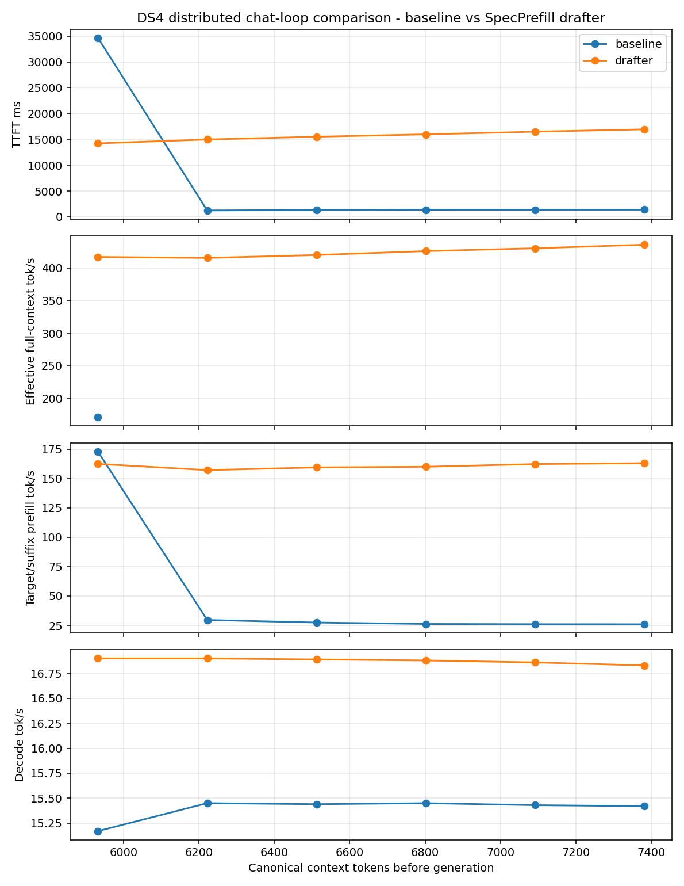

# DS4 distributed chat-loop comparison - baseline vs SpecPrefill drafter

Generated by `speed-bench/specprefill_chat_loop.py`.

## Measurement Definitions

- `effective prompt tok/s` = canonical prompt tokens / TTFT.
- `TTFT` = turn start to first emitted token; DS4 breakdown includes drafter, compression, target prefill, and first decode.
- `target prefill tok/s` = actual synced suffix tokens / target prefill time.
- `decode tok/s` = emitted tokens / decode elapsed after prefill.
- `ctx` is target KV/session tokens when available; `transcript` is canonical chat tokens.
- Chart x-axis is canonical prompt/context tokens before generation, not turn index.
- Baseline follow-up `effective prompt tok/s` is omitted from the chart because baseline reuses KV and only prefills the suffix; dividing full canonical context by warm TTFT is not an actual prefill rate.

## Per-Turn Measurements

| turn | baseline prompt ctx | baseline transcript | baseline ctx | baseline sync | baseline suffix | baseline eff tok/s | baseline TTFT ms | baseline target tok/s | baseline decode tok/s | drafter prompt ctx | drafter transcript | drafter ctx | drafter sync | drafter suffix | drafter eff tok/s | drafter TTFT ms | drafter target tok/s | drafter decode tok/s |
|---:|---:|---:|---:|---:|---:|---:|---:|---:|---:|---:|---:|---:|---:|---:|---:|---:|---:|---:|
| 1 | 5,932 | 6,189 | 6,188 | 5,932 | 5,932 | 171.1 | 34660.8 | 173.1 | 15.2 | 5,932 | 6,189 | 2,256 | 2,000 | 2,000 | 416.9 | 14227.4 | 162.6 | 16.9 |
| 2 | 6,222 | 6,479 | 6,478 | 6,222 | 34 | 5037.5 | 1235.1 | 29.6 | 15.4 | 6,222 | 6,479 | 2,318 | 2,062 | 2,062 | 415.4 | 14976.6 | 157.3 | 16.9 |
| 3 | 6,512 | 6,769 | 6,768 | 6,512 | 34 | 4937.6 | 1318.8 | 27.4 | 15.4 | 6,512 | 6,769 | 2,416 | 2,160 | 2,160 | 419.9 | 15508.1 | 159.6 | 16.9 |
| 4 | 6,802 | 7,059 | 7,058 | 6,802 | 34 | 4947.7 | 1374.8 | 26.2 | 15.4 | 6,802 | 7,059 | 2,482 | 2,226 | 2,226 | 425.9 | 15969.6 | 160.1 | 16.9 |
| 5 | 7,092 | 7,349 | 7,348 | 7,092 | 34 | 5140.7 | 1379.6 | 26.0 | 15.4 | 7,092 | 7,349 | 2,580 | 2,324 | 2,324 | 430.2 | 16484.8 | 162.4 | 16.9 |
| 6 | 7,382 | 7,639 | 7,638 | 7,382 | 34 | 5326.0 | 1386.0 | 26.0 | 15.4 | 7,382 | 7,639 | 2,646 | 2,390 | 2,390 | 435.7 | 16941.2 | 163.2 | 16.8 |

## Chart

## Notes

- DS4 baseline REPL keeps a live KV session and may only prefill the new suffix on follow-up turns.
- SpecPrefill `fresh` mode recompresses the full canonical transcript each turn, then syncs the compressed target view.
- Use the TTFT breakdown columns in `metrics.csv` to separate drafter/scoring cost from target distributed prefill cost.
