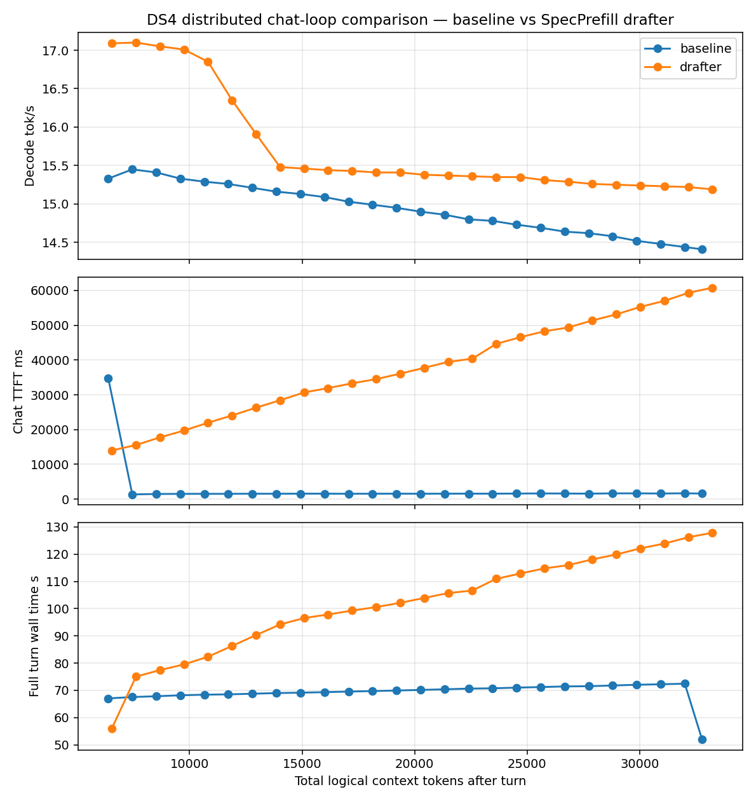

# DS4 distributed chat-loop comparison — baseline vs SpecPrefill drafter

Generated by `speed-bench/specprefill_chat_loop.py`.

Real chat-loop test: both modes ran the same prompt sequence while the
logical conversation context grew. This is an actual-usage comparison,
not a cold-prefill sweep at each context length.

## Measurement Definitions

- `ctx` = total logical chat context tokens after the turn.
- `target ctx` = DS4 target KV/session tokens after the turn; for SpecPrefill this is compressed.
- `TTFT` = chat turn start to first emitted token; DS4 breakdown includes drafter, compression, target prefill, and first decode.
- `wall time` = full scripted turn time, including the complete generated response.
- `decode tok/s` = emitted tokens / decode elapsed after prefill.
- Chart x-axis is total logical context tokens, matching the mini-01 Qwen revalidation style.
- Baseline follow-up TTFT is warm-continuation TTFT: the prior context is resident in KV and only the new suffix is synced.

## Per-Turn Measurements

| turn | baseline ctx | baseline target ctx | baseline TTFT ms | baseline wall s | baseline decode tok/s | drafter ctx | drafter target ctx | drafter compressed | drafter TTFT ms | drafter wall s | drafter decode tok/s |
|---:|---:|---:|---:|---:|---:|---:|---:|---:|---:|---:|---:|
| 1 | 6,390 | 6,389 | 34724.9 | 67.1 | 15.3 | 6,552 | 2,619 | 2,000 | 13991.2 | 56.1 | 17.1 |
| 2 | 7,457 | 7,456 | 1330.2 | 67.6 | 15.4 | 7,619 | 3,202 | 2,178 | 15534.0 | 75.0 | 17.1 |
| 3 | 8,524 | 8,523 | 1461.7 | 67.8 | 15.4 | 8,686 | 3,533 | 2,509 | 17747.1 | 77.4 | 17.1 |
| 4 | 9,591 | 9,590 | 1492.2 | 68.2 | 15.3 | 9,753 | 3,832 | 2,808 | 19704.2 | 79.5 | 17.0 |
| 5 | 10,658 | 10,657 | 1509.7 | 68.4 | 15.3 | 10,820 | 4,163 | 3,139 | 21961.2 | 82.4 | 16.9 |
| 6 | 11,725 | 11,724 | 1498.8 | 68.5 | 15.3 | 11,887 | 4,494 | 3,470 | 24042.5 | 86.3 | 16.4 |
| 7 | 12,792 | 12,791 | 1539.2 | 68.8 | 15.2 | 12,954 | 4,793 | 3,769 | 26301.2 | 90.3 | 15.9 |
| 8 | 13,859 | 13,858 | 1525.0 | 69.0 | 15.2 | 14,021 | 5,124 | 4,100 | 28411.7 | 94.2 | 15.5 |
| 9 | 14,926 | 14,925 | 1549.9 | 69.2 | 15.1 | 15,088 | 5,455 | 4,431 | 30676.5 | 96.5 | 15.5 |
| 10 | 15,993 | 15,992 | 1552.1 | 69.3 | 15.1 | 16,155 | 5,754 | 4,730 | 31914.4 | 97.9 | 15.4 |
| 11 | 17,060 | 17,059 | 1519.0 | 69.6 | 15.0 | 17,222 | 6,085 | 5,061 | 33307.9 | 99.3 | 15.4 |
| 12 | 18,127 | 18,126 | 1540.1 | 69.7 | 15.0 | 18,289 | 6,416 | 5,392 | 34502.0 | 100.6 | 15.4 |
| 13 | 19,194 | 19,193 | 1547.7 | 69.9 | 14.9 | 19,356 | 6,715 | 5,691 | 36076.7 | 102.1 | 15.4 |
| 14 | 20,261 | 20,260 | 1527.5 | 70.2 | 14.9 | 20,423 | 7,046 | 6,022 | 37749.3 | 103.9 | 15.4 |
| 15 | 21,328 | 21,327 | 1548.2 | 70.4 | 14.9 | 21,490 | 7,345 | 6,321 | 39457.5 | 105.7 | 15.4 |
| 16 | 22,395 | 22,394 | 1559.6 | 70.7 | 14.8 | 22,557 | 7,676 | 6,652 | 40380.2 | 106.7 | 15.4 |
| 17 | 23,462 | 23,461 | 1552.2 | 70.8 | 14.8 | 23,624 | 8,007 | 6,983 | 44638.3 | 111.0 | 15.3 |
| 18 | 24,529 | 24,528 | 1585.0 | 71.0 | 14.7 | 24,691 | 8,306 | 7,282 | 46555.9 | 112.9 | 15.3 |
| 19 | 25,596 | 25,595 | 1620.8 | 71.2 | 14.7 | 25,758 | 8,637 | 7,613 | 48262.4 | 114.8 | 15.3 |
| 20 | 26,663 | 26,662 | 1591.3 | 71.4 | 14.6 | 26,825 | 8,968 | 7,944 | 49365.9 | 116.0 | 15.3 |
| 21 | 27,730 | 27,729 | 1559.6 | 71.5 | 14.6 | 27,892 | 9,267 | 8,243 | 51382.2 | 118.1 | 15.3 |
| 22 | 28,797 | 28,796 | 1636.3 | 71.8 | 14.6 | 28,959 | 9,598 | 8,574 | 53139.2 | 119.9 | 15.2 |
| 23 | 29,864 | 29,863 | 1643.2 | 72.1 | 14.5 | 30,026 | 9,929 | 8,905 | 55296.5 | 122.1 | 15.2 |
| 24 | 30,931 | 30,930 | 1598.7 | 72.2 | 14.5 | 31,093 | 10,228 | 9,204 | 57018.9 | 123.9 | 15.2 |
| 25 | 31,998 | 31,997 | 1658.1 | 72.5 | 14.4 | 32,160 | 10,559 | 9,535 | 59325.0 | 126.2 | 15.2 |
| 26 | 32,768 | 32,767 | 1581.4 | 51.9 | 14.4 | 33,227 | 10,896 | 9,872 | 60814.7 | 127.8 | 15.2 |

## Chart

## Notes

- DS4 baseline REPL keeps the full live KV session and only syncs new suffix tokens on follow-up turns.
- SpecPrefill `fresh` mode recompresses the full canonical transcript each turn, then syncs the compressed target view.
- Use `metrics.csv` for the TTFT breakdown columns (`drafter_ms`, `target_prefill_ms`, `first_decode_ms`) and suffix/sync counts.

## Setup

- DS4 distributed over TB5/link-local: coordinator on mini-03 `169.254.124.226:1249`, worker on mini-02.
- Coordinator layers `0:19`; worker layers `20:output`; both sides used `--warm-weights`.
- Model: `/Users/carl/models/ds4-gguf/DeepSeek-V4-Flash-IQ2XXS-w2Q2K-AProjQ8-SExpQ8-OutQ8-chat-v2-imatrix.gguf`.
- SpecPrefill: live local drafter `/Users/Shared/models/qwen3.5-0.8b-mlx-4bit`, `fresh` cache, keep `0.3`, sink `16`, tail `256`, chunk `32`.
