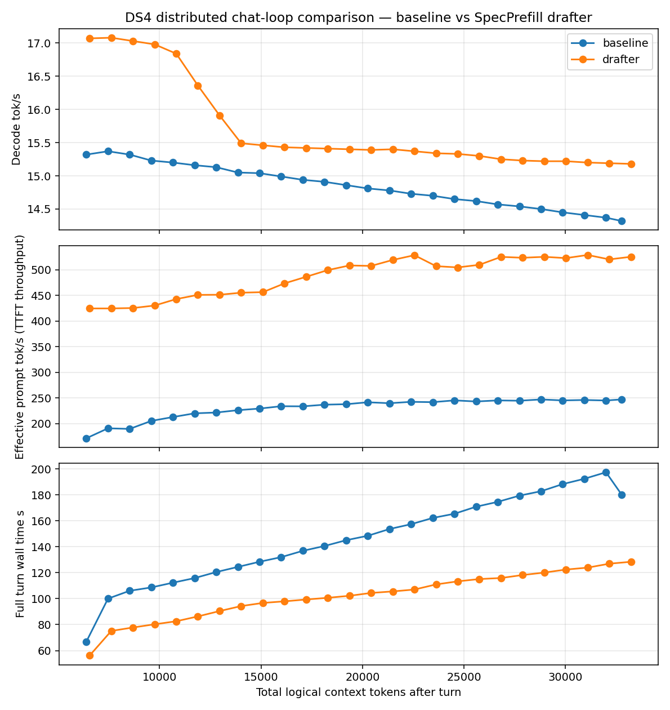

# DS4 distributed chat-loop comparison — baseline vs SpecPrefill drafter

Generated by `speed-bench/specprefill_chat_loop.py`.

Real chat-loop test: both modes ran the same prompt sequence while the
logical conversation context grew. This is an actual-usage comparison,
not a cold-prefill sweep at each context length.

## Measurement Definitions

- `ctx` = total logical chat context tokens after the turn.
- `target ctx` = DS4 target KV/session tokens after the turn; for SpecPrefill this is compressed.
- `suffix` = tokens actually prefetched/synced for the turn after KV common-prefix reuse.
- `generated` = tokens emitted into the live DS4 session during the turn.
- `TTFT` = chat turn start to first emitted token; DS4 breakdown includes drafter, compression, target prefill, and first decode.
- Default benchmark semantics match mini-01: the model process stays loaded, but `/ctx` resets live KV before each follow-up so each turn prefills the full accumulated transcript.
- Warm follow-up `TTFT` values, when explicitly requested with `--chat-cache warm-repl`, are suffix-prefill timings; TTFT charts omit them unless the turn did a full sync or SpecPrefill recompress.
- `wall time` = full scripted turn time, including the complete generated response.
- `decode tok/s` = emitted tokens / decode elapsed after prefill.
- Chart x-axis is total logical context tokens, matching the mini-01 Qwen revalidation style.
- `--chat-cache warm-repl` keeps live KV across turns and is not the mini-01 comparison.

## Per-Turn Measurements

| turn | baseline ctx | baseline target ctx | baseline suffix | baseline generated | baseline TTFT ms | baseline wall s | baseline decode tok/s | drafter ctx | drafter target ctx | drafter compressed | drafter suffix | drafter generated | drafter TTFT ms | drafter wall s | drafter decode tok/s |
|---:|---:|---:|---:|---:|---:|---:|---:|---:|---:|---:|---:|---:|---:|---:|---:|
| 1 | 6,390 | 6,389 | 5,932 | 457 | 34655.3 | 66.9 | 15.3 | 6,552 | 2,619 | 2,000 | 2,000 | 619 | 13979.7 | 56.2 | 17.1 |
| 2 | 7,457 | 7,456 | 6,432 | 1,024 | 33745.8 | 100.0 | 15.4 | 7,619 | 3,202 | 2,178 | 2,178 | 1,024 | 15538.4 | 75.1 | 17.1 |
| 3 | 8,524 | 8,523 | 7,499 | 1,024 | 39589.8 | 106.1 | 15.3 | 8,686 | 3,533 | 2,509 | 2,509 | 1,024 | 18019.6 | 77.8 | 17.0 |
| 4 | 9,591 | 9,590 | 8,566 | 1,024 | 41774.8 | 108.6 | 15.2 | 9,753 | 3,832 | 2,808 | 2,808 | 1,024 | 20297.7 | 80.3 | 17.0 |
| 5 | 10,658 | 10,657 | 9,633 | 1,024 | 45315.5 | 112.3 | 15.2 | 10,820 | 4,163 | 3,139 | 3,139 | 1,024 | 22129.6 | 82.6 | 16.8 |
| 6 | 11,725 | 11,724 | 10,700 | 1,024 | 48682.0 | 115.9 | 15.2 | 11,887 | 4,494 | 3,470 | 3,470 | 1,024 | 24096.7 | 86.3 | 16.4 |
| 7 | 12,792 | 12,791 | 11,767 | 1,024 | 53158.9 | 120.5 | 15.1 | 12,954 | 4,793 | 3,769 | 3,769 | 1,024 | 26446.3 | 90.4 | 15.9 |
| 8 | 13,859 | 13,858 | 12,834 | 1,024 | 56809.1 | 124.5 | 15.1 | 14,021 | 5,124 | 4,100 | 4,100 | 1,024 | 28558.6 | 94.3 | 15.5 |
| 9 | 14,926 | 14,925 | 13,901 | 1,024 | 60682.5 | 128.4 | 15.0 | 15,088 | 5,455 | 4,431 | 4,431 | 1,024 | 30832.3 | 96.7 | 15.5 |
| 10 | 15,993 | 15,992 | 14,968 | 1,024 | 64063.7 | 132.0 | 15.0 | 16,155 | 5,754 | 4,730 | 4,730 | 1,024 | 31971.3 | 97.9 | 15.4 |
| 11 | 17,060 | 17,059 | 16,035 | 1,024 | 68693.2 | 136.9 | 14.9 | 17,222 | 6,085 | 5,061 | 5,061 | 1,024 | 33321.9 | 99.4 | 15.4 |
| 12 | 18,127 | 18,126 | 17,102 | 1,024 | 72258.3 | 140.6 | 14.9 | 18,289 | 6,416 | 5,392 | 5,392 | 1,024 | 34588.3 | 100.7 | 15.4 |
| 13 | 19,194 | 19,193 | 18,169 | 1,024 | 76469.3 | 145.0 | 14.9 | 19,356 | 6,715 | 5,691 | 5,691 | 1,024 | 36074.3 | 102.2 | 15.4 |
| 14 | 20,261 | 20,260 | 19,236 | 1,024 | 79697.8 | 148.5 | 14.8 | 20,423 | 7,046 | 6,022 | 6,022 | 1,024 | 38239.1 | 104.4 | 15.4 |
| 15 | 21,328 | 21,327 | 20,303 | 1,024 | 84757.9 | 153.6 | 14.8 | 21,490 | 7,345 | 6,321 | 6,321 | 1,024 | 39436.8 | 105.6 | 15.4 |
| 16 | 22,395 | 22,394 | 21,370 | 1,024 | 88229.8 | 157.4 | 14.7 | 22,557 | 7,676 | 6,652 | 6,652 | 1,024 | 40765.1 | 107.0 | 15.4 |
| 17 | 23,462 | 23,461 | 22,437 | 1,024 | 92873.6 | 162.2 | 14.7 | 23,624 | 8,007 | 6,983 | 6,983 | 1,024 | 44594.1 | 111.0 | 15.3 |
| 18 | 24,529 | 24,528 | 23,504 | 1,024 | 95907.8 | 165.4 | 14.7 | 24,691 | 8,306 | 7,282 | 7,282 | 1,024 | 46920.9 | 113.3 | 15.3 |
| 19 | 25,596 | 25,595 | 24,571 | 1,024 | 101154.9 | 170.8 | 14.6 | 25,758 | 8,637 | 7,613 | 7,613 | 1,024 | 48551.6 | 115.1 | 15.3 |
| 20 | 26,663 | 26,662 | 25,638 | 1,024 | 104650.4 | 174.6 | 14.6 | 26,825 | 8,968 | 7,944 | 7,944 | 1,024 | 49150.4 | 115.9 | 15.2 |
| 21 | 27,730 | 27,729 | 26,705 | 1,024 | 109270.9 | 179.3 | 14.5 | 27,892 | 9,267 | 8,243 | 8,243 | 1,024 | 51352.1 | 118.2 | 15.2 |
| 22 | 28,797 | 28,796 | 27,772 | 1,024 | 112501.8 | 182.8 | 14.5 | 28,959 | 9,598 | 8,574 | 8,574 | 1,024 | 53210.7 | 120.1 | 15.2 |
| 23 | 29,864 | 29,863 | 28,839 | 1,024 | 117721.2 | 188.2 | 14.4 | 30,026 | 9,929 | 8,905 | 8,905 | 1,024 | 55501.8 | 122.4 | 15.2 |
| 24 | 30,931 | 30,930 | 29,906 | 1,024 | 121659.9 | 192.4 | 14.4 | 31,093 | 10,228 | 9,204 | 9,204 | 1,024 | 56883.0 | 123.9 | 15.2 |
| 25 | 31,998 | 31,997 | 30,973 | 1,024 | 126502.5 | 197.4 | 14.4 | 32,160 | 10,559 | 9,535 | 9,535 | 1,024 | 59873.8 | 126.9 | 15.2 |
| 26 | 32,768 | 32,767 | 32,040 | 727 | 129764.5 | 180.2 | 14.3 | 33,227 | 10,896 | 9,872 | 9,872 | 1,024 | 61330.2 | 128.4 | 15.2 |

## Chart

## Notes

- Default `--chat-cache cold-full-prompt` matches the mini-01 Qwen harness: reset KV between turns while keeping the model process loaded.
- SpecPrefill cache behavior is controlled by `--spec-prefill-cache`: default `fresh` recompresses the full canonical transcript every turn; `reuse` warm-extends target KV between recompresses.
- Use `metrics.csv` for the TTFT breakdown columns (`drafter_ms`, `target_prefill_ms`, `first_decode_ms`) and suffix/sync counts.
