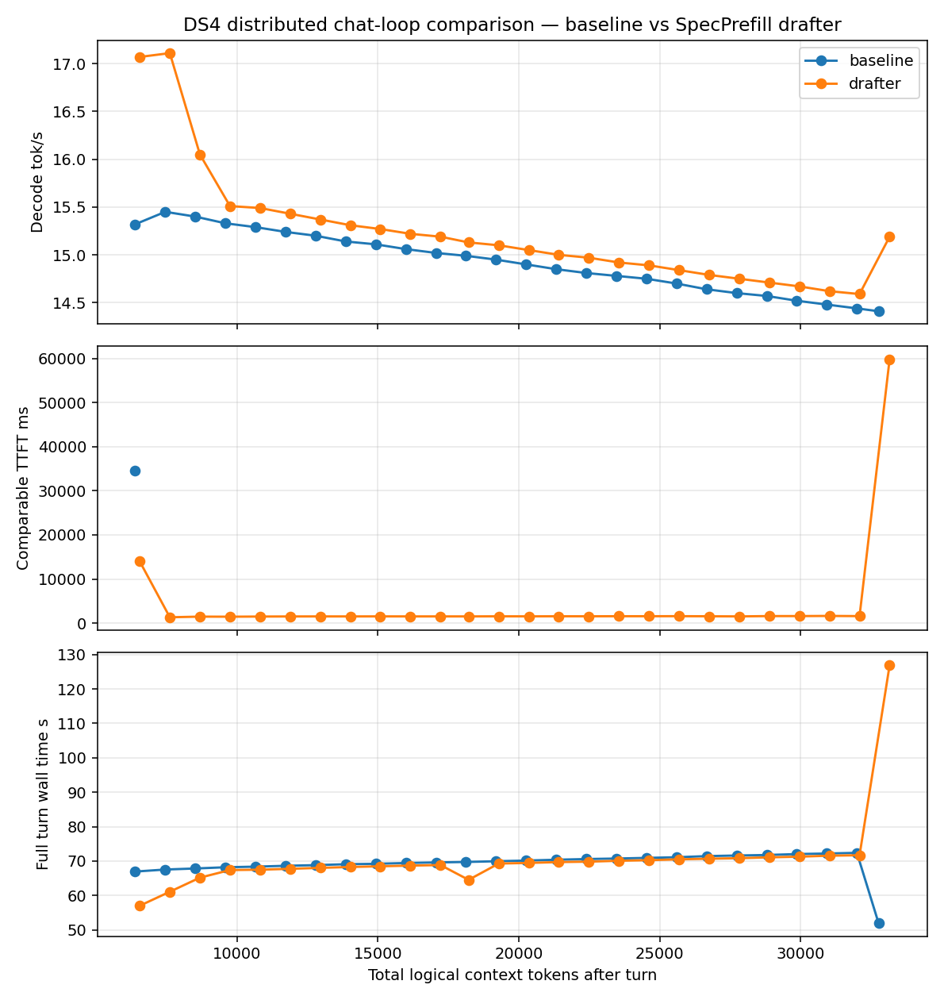

# DS4 distributed chat-loop comparison — baseline vs SpecPrefill drafter

Generated by `speed-bench/specprefill_chat_loop.py`.

Real chat-loop test: both modes ran the same prompt sequence while the
logical conversation context grew. This is an actual-usage comparison,
not a cold-prefill sweep at each context length.

## Setup

- Transport: TB5/link-local distributed DS4, coordinator on mini-03 at `169.254.124.226:1250`, worker on mini-02.
- Layers: coordinator `0:19`, worker `20:output`, both launched with `--warm-weights`.
- Model: `/Users/carl/models/ds4-gguf/DeepSeek-V4-Flash-IQ2XXS-w2Q2K-AProjQ8-SExpQ8-OutQ8-chat-v2-imatrix.gguf`.
- SpecPrefill drafter: `/Users/Shared/models/qwen3.5-0.8b-mlx-4bit`, live drafter scoring via `speed-bench/ds4_live_drafter.py`.
- SpecPrefill options: `--spec-prefill-cache reuse`, keep `0.30`, sink `16`, tail `256`, chunk `32`.

## Measurement Definitions

- `ctx` = total logical chat context tokens after the turn.
- `target ctx` = DS4 target KV/session tokens after the turn; for SpecPrefill this is compressed.
- `suffix` = tokens actually prefetched/synced for the turn after KV common-prefix reuse.
- `generated` = tokens emitted into the live DS4 session during the turn.
- `TTFT` = chat turn start to first emitted token; DS4 breakdown includes drafter, compression, target prefill, and first decode.
- Baseline follow-up `TTFT` values are warm suffix-prefill timings; the main TTFT chart omits them instead of plotting 1-2s as full-context baseline points.
- `wall time` = full scripted turn time, including the complete generated response.
- `decode tok/s` = emitted tokens / decode elapsed after prefill.
- Chart x-axis is total logical context tokens, matching the mini-01 Qwen revalidation style.
- Baseline follow-up TTFT is warm-continuation TTFT: the prior context is resident in KV and only the new suffix is synced. Use `suffix` to verify this.

## Per-Turn Measurements

| turn | baseline ctx | baseline target ctx | baseline suffix | baseline generated | baseline warm TTFT ms | baseline wall s | baseline decode tok/s | drafter ctx | drafter target ctx | drafter compressed | drafter suffix | drafter generated | drafter TTFT ms | drafter wall s | drafter decode tok/s |
|---:|---:|---:|---:|---:|---:|---:|---:|---:|---:|---:|---:|---:|---:|---:|---:|
| 1 | 6,390 | 6,389 | 5,932 | 457 | 34653.5 | 67.0 | 15.3 | 6,552 | 2,619 | 2,000 | 2,000 | 619 | 13968.4 | 57.0 | 17.1 |
| 2 | 7,457 | 7,456 | 43 | 1,024 | 1331.3 | 67.6 | 15.4 | 7,619 | 3,686 | - | 43 | 1,024 | 1310.1 | 61.1 | 17.1 |
| 3 | 8,524 | 8,523 | 43 | 1,024 | 1454.3 | 67.9 | 15.4 | 8,686 | 4,753 | - | 43 | 1,024 | 1457.6 | 65.2 | 16.1 |
| 4 | 9,591 | 9,590 | 43 | 1,024 | 1473.4 | 68.2 | 15.3 | 9,753 | 5,820 | - | 43 | 1,024 | 1438.8 | 67.4 | 15.5 |
| 5 | 10,658 | 10,657 | 43 | 1,024 | 1505.3 | 68.4 | 15.3 | 10,820 | 6,887 | - | 43 | 1,024 | 1476.0 | 67.5 | 15.5 |
| 6 | 11,725 | 11,724 | 43 | 1,024 | 1534.1 | 68.6 | 15.2 | 11,887 | 7,954 | - | 43 | 1,024 | 1496.4 | 67.8 | 15.4 |
| 7 | 12,792 | 12,791 | 43 | 1,024 | 1540.4 | 68.8 | 15.2 | 12,954 | 9,021 | - | 43 | 1,024 | 1506.8 | 68.0 | 15.4 |
| 8 | 13,859 | 13,858 | 43 | 1,024 | 1562.1 | 69.1 | 15.1 | 14,021 | 10,088 | - | 43 | 1,024 | 1503.3 | 68.3 | 15.3 |
| 9 | 14,926 | 14,925 | 43 | 1,024 | 1536.4 | 69.2 | 15.1 | 15,088 | 11,155 | - | 43 | 1,024 | 1515.2 | 68.5 | 15.3 |
| 10 | 15,993 | 15,992 | 43 | 1,024 | 1524.0 | 69.4 | 15.1 | 16,155 | 12,222 | - | 43 | 1,024 | 1506.2 | 68.7 | 15.2 |
| 11 | 17,060 | 17,059 | 43 | 1,024 | 1519.2 | 69.6 | 15.0 | 17,222 | 13,289 | - | 43 | 1,024 | 1508.0 | 68.9 | 15.2 |
| 12 | 18,127 | 18,126 | 43 | 1,024 | 1535.8 | 69.8 | 15.0 | 18,220 | 14,287 | - | 43 | 955 | 1507.0 | 64.6 | 15.1 |
| 13 | 19,194 | 19,193 | 43 | 1,024 | 1532.1 | 70.0 | 14.9 | 19,287 | 15,354 | - | 43 | 1,024 | 1529.1 | 69.3 | 15.1 |
| 14 | 20,261 | 20,260 | 43 | 1,024 | 1513.3 | 70.2 | 14.9 | 20,354 | 16,421 | - | 43 | 1,024 | 1521.5 | 69.5 | 15.1 |
| 15 | 21,328 | 21,327 | 43 | 1,024 | 1527.1 | 70.4 | 14.8 | 21,421 | 17,488 | - | 43 | 1,024 | 1537.7 | 69.7 | 15.0 |
| 16 | 22,395 | 22,394 | 43 | 1,024 | 1559.1 | 70.6 | 14.8 | 22,488 | 18,555 | - | 43 | 1,024 | 1534.2 | 69.8 | 15.0 |
| 17 | 23,462 | 23,461 | 43 | 1,024 | 1542.4 | 70.7 | 14.8 | 23,555 | 19,622 | - | 43 | 1,024 | 1549.1 | 70.1 | 14.9 |
| 18 | 24,529 | 24,528 | 43 | 1,024 | 1591.8 | 70.9 | 14.8 | 24,622 | 20,689 | - | 43 | 1,024 | 1548.3 | 70.3 | 14.9 |
| 19 | 25,596 | 25,595 | 43 | 1,024 | 1575.8 | 71.1 | 14.7 | 25,689 | 21,756 | - | 43 | 1,024 | 1559.4 | 70.5 | 14.8 |
| 20 | 26,663 | 26,662 | 43 | 1,024 | 1578.3 | 71.4 | 14.6 | 26,756 | 22,823 | - | 43 | 1,024 | 1537.7 | 70.7 | 14.8 |
| 21 | 27,730 | 27,729 | 43 | 1,024 | 1577.3 | 71.6 | 14.6 | 27,823 | 23,890 | - | 43 | 1,024 | 1511.8 | 70.8 | 14.8 |
| 22 | 28,797 | 28,796 | 43 | 1,024 | 1599.8 | 71.8 | 14.6 | 28,890 | 24,957 | - | 43 | 1,024 | 1580.4 | 71.1 | 14.7 |
| 23 | 29,864 | 29,863 | 43 | 1,024 | 1583.0 | 72.0 | 14.5 | 29,957 | 26,024 | - | 43 | 1,024 | 1580.8 | 71.3 | 14.7 |
| 24 | 30,931 | 30,930 | 43 | 1,024 | 1574.6 | 72.2 | 14.5 | 31,024 | 27,091 | - | 43 | 1,024 | 1615.4 | 71.6 | 14.6 |
| 25 | 31,998 | 31,997 | 43 | 1,024 | 1599.3 | 72.4 | 14.4 | 32,091 | 28,158 | - | 43 | 1,024 | 1573.1 | 71.7 | 14.6 |
| 26 | 32,768 | 32,767 | 43 | 727 | 1584.5 | 51.9 | 14.4 | 33,158 | 10,853 | 9,829 | 9,829 | 1,024 | 59878.2 | 126.9 | 15.2 |

## Chart

## Notes

- DS4 baseline REPL keeps the full live KV session and only syncs new suffix tokens on follow-up turns.
- SpecPrefill cache behavior is controlled by `--spec-prefill-cache`: `reuse` warm-extends target KV between recompresses; `fresh` recompresses the full canonical transcript every turn.
- Use `metrics.csv` for the TTFT breakdown columns (`drafter_ms`, `target_prefill_ms`, `first_decode_ms`) and suffix/sync counts.
